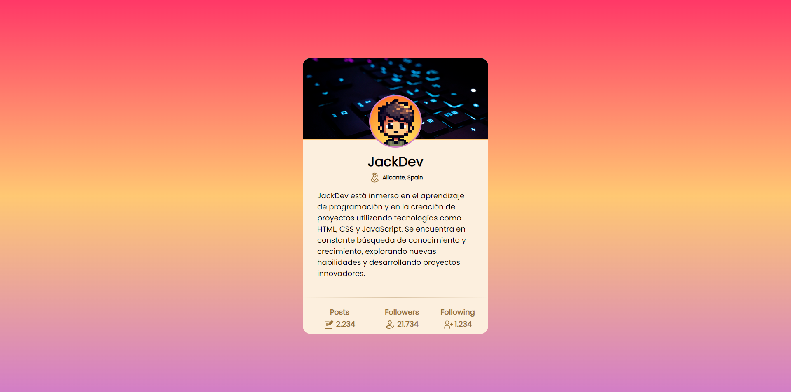

# manzdev-retos-titulo

🌍 **URL del reto**: *https://lenguajejs.com/retos/nivel-facil/basic-card/*

## Datos

- 🦄 **Desarrollador/a:** JackDev
- - 🐇 **Link a red social:** *https://github.com/JackDev21*
- 🦾 **Perfil:** Bajo
- 💬 **Un comentario breve o frase ingeniosa**:

## Observaciones

_Escribe aquí tus observaciones sobre la implementación_

> Puedes encontrar otros retos de Manz.dev en:  ▶ https://lenguajejs.com/retos/

---

_Puedes borrar todo desde esta línea en adelante_

---

Recuerda cambiar el título del repo, los datos y desplegar la versión en GitHub Pages e indicar la URL en la esquina superior derecha de tu repositorio de GitHub, junto a una pequeña descripción.
